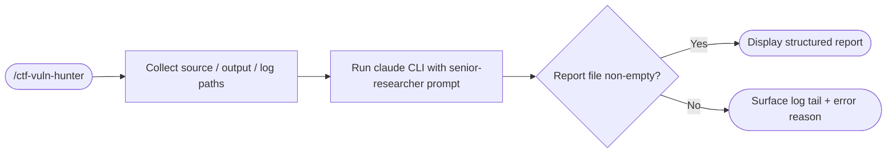

# ctf-vuln-hunter

  

A Claude Code skill that runs an autonomous vulnerability scan on source code and produces a structured security report — covering the finding, its location, a replication PoC, a corrected patch, and a severity rating.

---

## How it works



---

## Installation

The skill ships as a Claude Code command. Drop it into your project's `.claude/commands/` directory:

```bash
cp .claude/commands/ctf-vuln-hunter.md /your-project/.claude/commands/
```

Or clone this repo and open it in Claude Code — the skill is available immediately in any session.

**Requirement:** Claude Code CLI must be installed:

```bash
npm install -g @anthropic-ai/claude-code
```

---

## Usage

Trigger the skill with any of these phrases in a Claude Code session:

- `/ctf-vuln-hunter`
- "scan for vulnerabilities in ..."
- "audit this code"
- "CTF analysis"
- "find bugs in ..."
- "exploit analysis"

Claude will ask for three paths (defaults shown):

| Input | Default |
|---|---|
| Source path | *(required)* |
| Output path | `/tmp/vuln_report.txt` |
| Log path | `/tmp/claude_vuln.log` |

If you paste code inline or upload a file, it is saved to `/tmp/target_src/` automatically.

---

## Report format

Every scan produces a report with exactly six sections:

```
VULNERABILITY REPORT
====================

## Vulnerability
[Name and CWE ID]

## Location
[File, function, line number(s)]

## Description
[Technical explanation of the flaw and its impact]

## How to Replicate
[Step-by-step PoC or minimal payload]

## Proposed Fix
[Corrected code snippet with explanation]

## Severity
[CRITICAL / HIGH / MEDIUM / LOW — with justification]
```

If no vulnerability is found the report contains `NO VULNERABILITIES DETECTED`.

---

## Python API

The scanner logic is also available as a Python module:

```python
from src.runner import run_scan, InstallationError, NonZeroExitError
from src.report_parser import parse

try:
    raw = run_scan(
        source_path="/path/to/target.c",
        output_path="/tmp/report.txt",
        log_path="/tmp/scan.log",
    )
    report = parse(raw)
    print(report.severity, report.vulnerability)
except InstallationError as e:
    print(e)   # claude CLI not found
except NonZeroExitError as e:
    print(e)   # includes last 20 log lines
```

---

## Running tests

```bash
pytest
```

---

## Error handling

| Situation | Behaviour |
|---|---|
| `claude` CLI not on PATH | `InstallationError` — tells you to run `npm install -g @anthropic-ai/claude-code` |
| Source path does not exist | User is prompted to confirm the path before the scan runs |
| Report file empty after scan | Last 20 lines of the log file are returned |
| Non-zero exit code | `NonZeroExitError` with exit code and last 20 log lines |

---

## Security note

`--dangerously-skip-permissions` is required so the CLI can read source files and write the report without interactive prompts. Only point this skill at code you own or are authorized to test.

---

**Developer:** Eduardo Arana · [ko-fi](https://ko-fi.com/H2H51MPWG)

**License:** [MIT](LICENSE) · [Contributing](CONTRIBUTING.md) · [Security](SECURITY.md)
